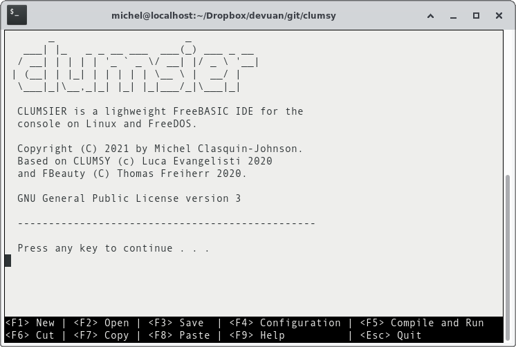

# CLUMSIER

CLUMSIER is an lightweight [FreeBASIC](www.freebasic.net) IDE for console on FreeDOS or Linux, written in FreeBASIC itself.

***Linux Users:** When I say "for console", I mean the big black screen you get when you press CTRL-ALT-F1. It will run in a Terminal Emulator under X11 like Gnome-Terminal or Xterm (in fact, that is how I made the screenshot above), but those emulators may swallow up the keystrokes for their own use before they ever reach my program. You can probably remap the keystrokes in your terminal emulator to some extent.*

This fork represents my edits to the original [Clumsy by Luca Evangelisti](https://github.com/lucaevangelisti/clumsy). I'm doing this mostly to learn the FreeBASIC dialect, and also because I want a console FB IDE for myself.

CLUMSIER is controlled mostly with function keys, but also has Control-key shortcuts. For example, ctrl-s, ctrl-x and ctrl-v behave like the normal save cut and paste keys (note that cut and paste work on whole lines). Some more obscure function keys are not displayed on the onscreen help but can be revealed with F9. On some setups F11 and F12 may not be detected properly (they were later additions to the PC standard) and you will have to use the CTRL equivalents instead.

FreeBASIC is a complex language, indeed some people claim its creators are trying to turn BASIC into C++. To assist in learning this dialect, The Linux version of Clumsier has a "Keyword of the Day" feature that will display a random part of the FreeBASIC help files. This should be used in conjunction with the normal FreeBASIC manual, not instead of it! It turned out that the DOS filesystem in unable to handle the demands this feature places on the file system, and it has not been enabled there.

Press F9 for a complete Help display.

## Compilation

You will need FreeBASIC to be installed.

### FreeDOS

Use the included *COMPILE.BAT*. Just issuing the command COMPILE should do it. The batch file tries to find the *fbc* compiler, but if yours is installed in a weird place, just open up the batch file in a text editor and see what it does. It's not that complicated.

### Linux

Use the included *compile* shell script, as follows: *./compile.sh*. This *might* also work on the BSDs, but I have no way to test that, sorry.

## Installation

### FreeDOS

Use the included *INSTALL.BAT* after compiling. Just issuing the command INSTALL should do it. The batch file tries to find the directory containing the *fbc* compiler, but if yours is installed in a weird place, just open up the batch file in a text editor and see what it does. It's not that complicated. If it is found, CLUMSIER will be installed in a subdirectory of that. A launcher batch file on your PATH will be created to let you start CLUMSIER with a single command.

### Linux

Use the included *install* shell script after compiling, as follows: *./install.sh*. This will install CLUMSIER into ~/.comfig/clumsier, project files in ~/clumsier_prj and a launcher script into /us/local/bin.

## Usage

+ F1 or CTRL-N - Open a new file.
+ F2 or CTRL-O - Open an existing file.
+ F3 or CTRL-S - Save the current file.
+ F4 or CTRL-Z - Edit the location of the FreeBasic Compiler.
+ F5 or CTRL-R - Compile and run your program.

+ F6 or CTRL-X - Cut the current line to memory.  
+ F7           - Copy the current line to memory.  
**Note:** CTRL-C is disabled because it crashes the program.  
**Note:** These commands do not interact with the Linux system clipboard.
+ F8 or CTRL-V - Paste a line from memory to the current cursor position.
+ F9           - Help
+ F10 or CTRL-P - Prettyprinting: change all FreeBASIC keywords to uppercase.
+ F11 or CTRL-F - In Linux, display a random Keyword of the Day. Not used in FreeDOS
+ F12 or CTRL-B - Create a backup file
+ ESC or CTRL-Q - Quit

(C) Michel Clasquin 2021, Released under GPLv3.

